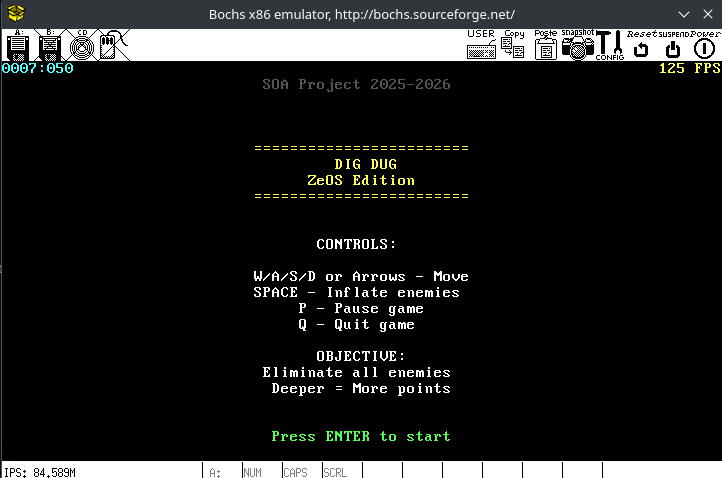
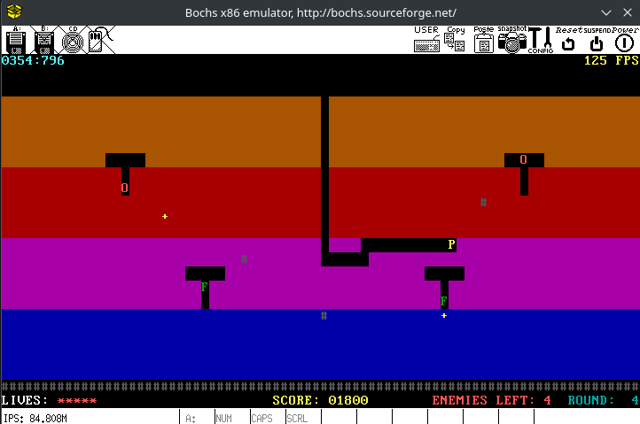
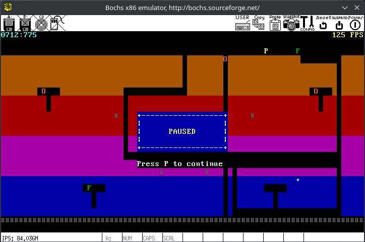
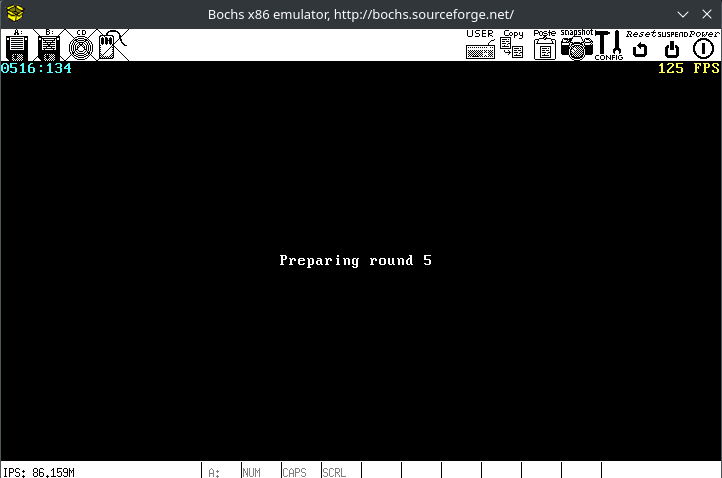
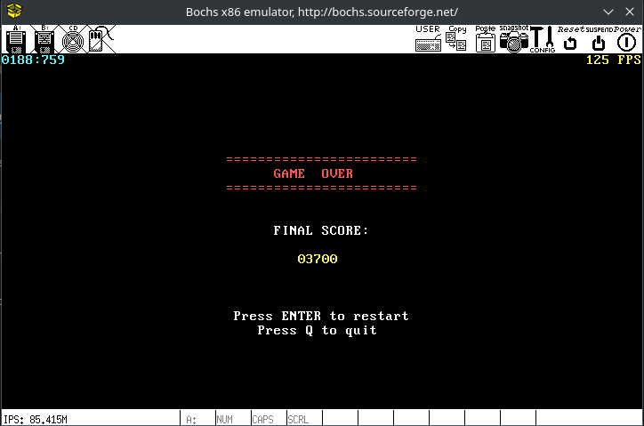
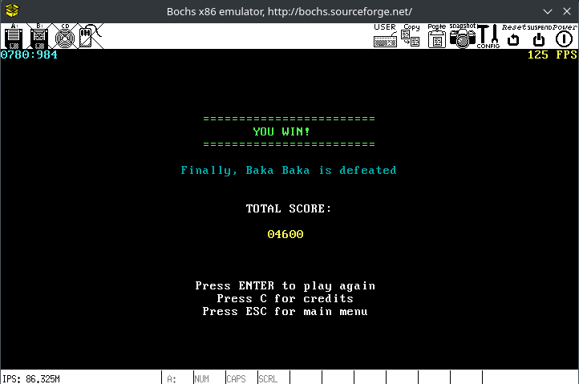
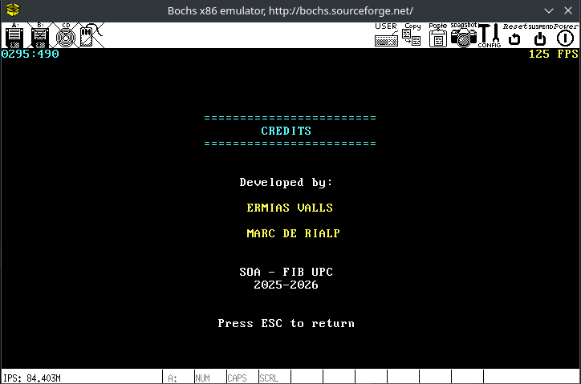

# ZeOS Operating System

## Overview
ZeOS is a Unix-like operating system built for educational purposes. It implements process management, memory management, fast system calls via SYSENTER, interrupt handling, and includes a test framework. The system is designed for x86 architecture and runs on the Bochs emulator with debugging support.

## Project Structure

- **[Makefile](Makefile)** - Root Makefile that redirects commands to zeos/ directory
- **[ConfigZeos.md](ConfigZeos.md)** - Configuration details for ZeOS setup
- **[zeos/](zeos/)** - Base ZeOS source code (E1 & E2 deliverables)
- **[project/](project/)** - Extended ZeOS with threads, keyboard and screen support for Dig Dug game
- **[docs/](docs/)** - Documentation and guides
  - **[project_milestones/](docs/project_milestones/)** - Milestone documentation files
  - **[guides/](docs/guides/)** - Debugger guides (Bochs internal, GDB external)
  - **[doxygen/](docs/doxygen/)** - Doxygen configuration and generated docs
  - **[img/](docs/img/)** - Screenshots and images
  - **[ZeOsArchitecture.md](docs/ZeOsArchitecture.md)** - ZeOs architecture documentation
  - **[DigDugGameArchitecture.md](docs/DigDugGameArchitecture.md)** - Game architecture documentation
- **backup/** - Automatically created backup directory containing:
  - **zeos_versions/** - Timestamped .tar.gz backups of the ZeOS directory
  - **project_versions/** - Timestamped .tar.gz backups of the complete project

---

## ZeOS Base System

The base ZeOS implementation (in `zeos/` directory) was developed in two deliverables.

### E1 - Basic System Calls and Hardware

- Keyboard management (interrupt handling, scancode processing)
- `write` system call (console output)
- Clock management (PIT timer configuration)
- `gettime` system call (tick counter access)
- Page fault exception management (error handling and stack growth)

### E2 - Process Management

- `task_struct` definition adaptation
- Free queue initialization
- Ready queue initialization
- Initial processes initialization (idle + init)
- `task_switch` function (high-level context switch)
- `inner_task_switch` function (low-level ESP switching)
- `getpid` system call
- `fork` system call (process duplication with COW)
- Process scheduling (Round-Robin with quantum)
- `exit` system call (process termination)
- `block` system call (process blocking)
- `unblock` system call (process unblocking)

> 📖 **For detailed architecture documentation, see [ZeOS Architecture](docs/ZeOsArchitecture.md)**
---

## Dig Dug Game

The project includes a complete implementation of a **Dig Dug clone** running on ZeOS. This arcade game demonstrates the OS capabilities including multi-threading, keyboard interrupts, and screen rendering.

### Project Milestones

Before implementing the game, several extensions were made to the base ZeOS system (obtained from E1 & E2 deliverables). The project was developed in **5 milestones**, each adding new functionality:

| Milestone | Description | Documentation |
|-----------|-------------|---------------|
| M1 | Thread Support | [M1_thread_support.txt](docs/project_milestones/M1_thread_support.txt) |
| M2 | Keyboard Support | [M2_keyboard_support.txt](docs/project_milestones/M2_keyboard_support.txt) |
| M3 | Screen Support | [M3_screen_support.txt](docs/project_milestones/M3_screen_support.txt) |
| M4 | Time Support | [M4_time_support.txt](docs/project_milestones/M4_time_support.txt) |
| M5 | Game Implementation | [M5_game_implementation.txt](docs/project_milestones/M5_game_implementation.txt) |

### About the Game

Dig Dug is a classic arcade game where the player digs underground tunnels to eliminate enemies. The player can defeat enemies by inflating them with a pump or crushing them with falling rocks.

**Objective:** Eliminate all enemies in each round to progress. Complete 5 rounds to win the game.

**Controls:**
- **Arrow keys / WASD** - Move player (also digs through dirt)
- **SPACE** - Attack with pump (inflate enemies)
- **P** - Pause game
- **ESC** - Quit / Return to menu
- **ENTER** - Select menu options

**Enemies:**
- **Pooka (O)** - Basic enemy that chases the player
- **Fygar (F)** - Dragon that can breathe fire horizontally

### Game Screens

| Screen | Description |
|--------|-------------|
|  | **Main Menu** - Press ENTER to start |
|  | **Gameplay** - Dig tunnels and defeat enemies |
|  | **Paused** - Game paused overlay |
|  | **Round Start** - Preparing next round |
|  | **Game Over** - Final score display |
|  | **Victory** - All rounds completed |
|  | **Credits** - Developer credits |

> 📖 **For detailed game architecture documentation, see [Dig Dug Architecture](docs/DigDugGameArchitecture.md)**
---

## Development Environment
- **Emulator**: Bochs 2.6.7 with internal debugger
- **Architecture**: x86 (32-bit)
- **Languages**: C, x86 Assembly
- **Build System**: GNU Make

## Course Information
**Subject**: Sistemas Operatius Avançats (SOA)  
**Institution**: Facultat d'Informàtica de Barcelona (FIB) - UPC  
**Academic Year**: 2025-2026

                           
## 👥 Credits 

- [Marc De Rialp](https://github.com/Derri725)
- [Ermias Valls](https://github.com/ermias-vm)